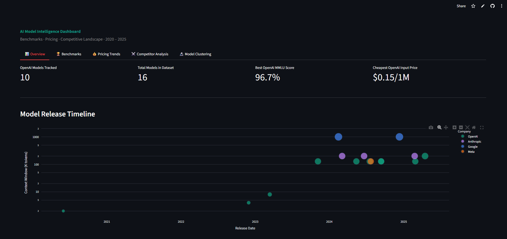

# AI Model Intelligence Dashboard

An interactive data analysis dashboard tracking the evolution of large language models across benchmarks, pricing, and competitive landscape from 2020–2025.

Built with Python, Streamlit, Plotly, and scikit-learn.

---

## Features

- **Overview** — Model release timeline, context window growth, and OpenAI specs at a glance
- **Benchmarks** — Compare models across MMLU, HumanEval, MATH, GPQA, and MGSM with interactive bar and radar charts
- **Pricing Trends** — Track API cost over time and identify the most cost-efficient models
- **Competitor Analysis** — Head-to-head comparison between any two models across all benchmarks
- **Model Clustering** — K-Means clustering with PCA visualization to group models by capability profile

---

## Demo

> _Add a screenshot or GIF here after deployment_

<!--  -->

---

## Getting Started

**1. Clone the repo**
```bash
git clone https://github.com/XeroPowerz/ai-model-intelligence-dashboard.git
cd ai-model-intelligence-dashboard
```

**2. Install dependencies**
```bash
pip install -r requirements.txt
```

**3. Run the app**
```bash
streamlit run app.py
```

The app will open at `http://localhost:8501`.

---

## Data Sources

| Dataset | Source |
|---------|--------|
| Benchmark scores (MMLU, HumanEval, MATH, GPQA, MGSM) | Model technical reports and papers |
| API pricing history | OpenAI, Anthropic, Google pricing pages |
| Model release dates & specs | Official announcements |

---

## Tech Stack

- [Streamlit](https://streamlit.io) — dashboard framework
- [Plotly](https://plotly.com/python/) — interactive charts
- [pandas](https://pandas.pydata.org) — data manipulation
- [scikit-learn](https://scikit-learn.org) — K-Means clustering, PCA

---

## Deployment

This app can be deployed for free on [Streamlit Community Cloud](https://share.streamlit.io):

1. Push this repo to GitHub
2. Go to share.streamlit.io and connect your repo
3. Set the main file path to `app.py`
